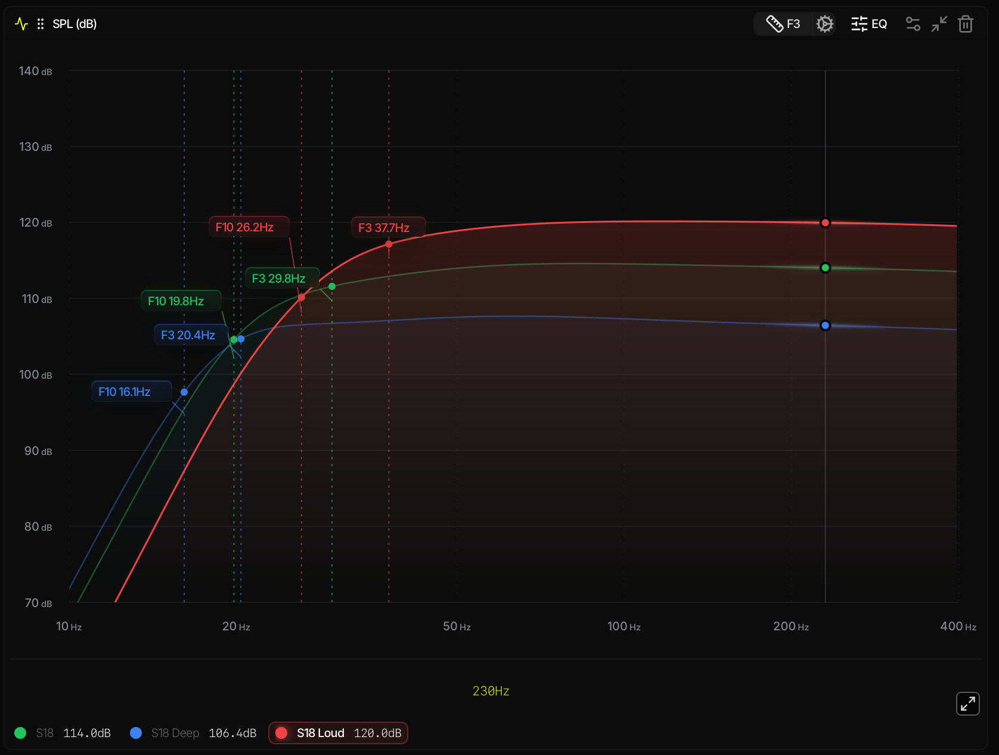
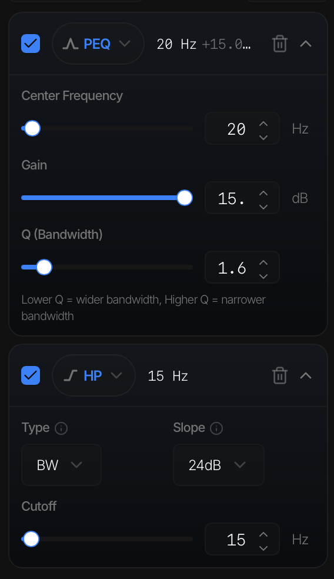
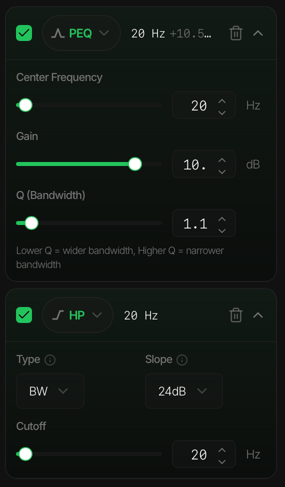
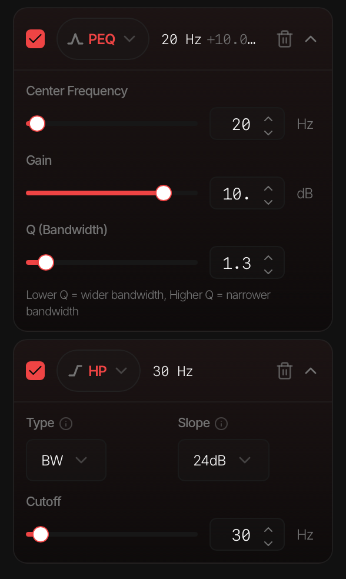

# S18 — 0 · Simulation

Initial sealed-box simulation of the BMS 18N862 in ~125 L sealed, including the three DSP presets.

**Live dashboard:** <https://simulator.00aud.io/app/share/18N862-125L-sealed-cmqpbl62e0003jp042uz99kmr>

## Results (simulated, ground plane)

| Preset | F3 (Hz) | F6 (Hz) | F10 (Hz) | Max SPL |
|---|---|---|---|---|
| S18 Deep | 20.4 | ~18 | 16.1 | 106.4 dB |
| S18 | 29.8 | ~25 | 19.8 | 114.0 dB |
| S18 Loud | 37.7 | ~32 | 26.2 | 120.0 dB |

Full EQ settings (high-pass + PEQ) per preset → [`/dsp-amp/bms-18n862`](../../../dsp-amp/bms-18n862/).

## EQ per preset

**S18 Deep** — PEQ 20 Hz +15.0 dB Q 1.6 · HP 15 Hz BW 24 dB/oct

**S18** (balanced) — PEQ 20 Hz +10.5 dB Q 1.1 · HP 20 Hz BW 24 dB/oct

**S18 Loud** — PEQ 20 Hz +10.0 dB Q 1.3 · HP 30 Hz BW 24 dB/oct

